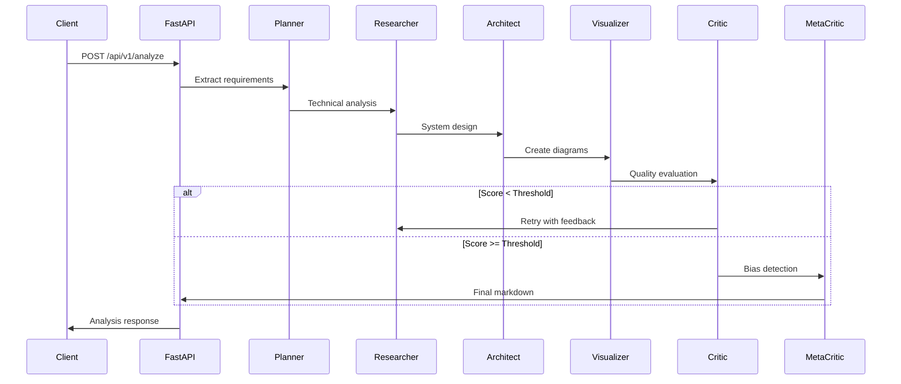

# ArcSys

Multi-agent AI research lab using LangChain, LangGraph, and FastAPI for structured system design analysis.

## Overview

ArcSys is a production-ready multi-agent system that simulates a structured AI research lab. Multiple specialized agents collaborate to analyze system design problems, providing comprehensive research, architecture design, and critical evaluation.

## Architecture

### API Flow Diagram


### Agent Workflow
1. **Planner Agent** - Extracts structured requirements from user queries
2. **Researcher Agent** - Performs deep technical research and analysis  
3. **Architect Agent** - Designs comprehensive system architecture
4. **Visualizer Agent** - Creates Mermaid diagrams and visual documentation
5. **Critic Agent** - Evaluates architecture quality and provides scoring
6. **Meta-Critic Agent** - Detects potential hallucinations and bias

### Technology Stack
- **FastAPI** - Modern, fast web framework for building APIs
- **LangChain** - LLM abstraction and prompt management
- **LangGraph** - Stateful workflow orchestration
- **Pydantic** - Data validation and settings management
- **Structlog** - Structured logging
- **Prometheus** - Metrics and monitoring

## Project Structure

```
arcsys/
├── app/
│   ├── main.py                 # FastAPI application factory
│   ├── api/
│   │   └── routes.py          # API route definitions
│   ├── agents/                # Multi-agent system
│   │   ├── base.py           # Base agent class
│   │   ├── planner.py        # Requirements extraction
│   │   ├── researcher.py     # Technical research
│   │   ├── architect.py      # System design
│   │   ├── visualizer.py     # Diagram generation
│   │   ├── critic.py         # Quality evaluation
│   │   └── meta_critic.py    # Bias detection
│   ├── core/                 # Core configuration
│   │   ├── config.py         # Settings management
│   │   ├── llm.py           # LLM client wrapper
│   │   └── logging.py       # Structured logging
│   ├── graph/               # Workflow orchestration
│   │   ├── state.py         # State management
│   │   └── builder.py       # Graph construction
│   ├── monitoring/          # Observability
│   │   └── metrics.py       # Prometheus metrics
│   ├── schemas/             # Data models
│   │   └── api.py          # API schemas
│   └── utils/               # Utilities
│       ├── exceptions.py    # Custom exceptions
│       └── security.py      # Security utilities
├── tests/                   # Test suite
├── requirements.txt         # Python dependencies
├── pyproject.toml          # Project configuration
├── .env.example            # Environment template
└── .gitignore              # Git ignore patterns
```

## Installation

### Prerequisites
- Python 3.11 or higher
- OpenRouter API key

### Setup

1. **Clone and setup environment:**
```bash
git clone <repository-url>
cd arcsys
python -m venv venv
source venv/bin/activate  # On Windows: venv\\Scripts\\activate
pip install -r requirements.txt
```

2. **Configure environment:**
```bash
cp .env.example .env
# Edit .env with your configuration
```

3. **Required environment variables:**
```bash
OPENROUTER_API_KEY=your_openrouter_api_key_here
```

## Usage

### Development Server

Start the development server:
```bash
uvicorn app.main:app --reload --host 0.0.0.0 --port 8000
```

API will be available at:
- **API**: http://localhost:8000/api/v1
- **Documentation**: http://localhost:8000/docs
- **Metrics**: http://localhost:8001 (development only)

### API Endpoints

#### Analyze System Design
```bash
POST /api/v1/analyze
Content-Type: application/json

{
  "query": "Design a real-time chat application with 1M+ concurrent users"
}
```

**Response:**
```json
{
  "final_markdown": "# Requirements\\n...",
  "critic_score": 8.5,
  "bias_score": 0.2,
  "iteration_count": 2,
  "processing_time": 45.3,
  "timestamp": "2024-01-01T12:00:00Z"
}
```

#### Health Check
```bash
GET /api/v1/health
```

## Configuration

### Environment Variables

| Variable | Description | Default | Required |
|----------|-------------|---------|----------|
| `OPENROUTER_API_KEY` | OpenRouter API key | - | Yes |
| `MODEL_NAME` | LLM model to use | `mistralai/mistral-7b-instruct:free` | No |
| `CRITIC_THRESHOLD` | Quality threshold for retry | `7.0` | No |
| `MAX_RETRIES` | Maximum retry attempts | `3` | No |
| `LOG_LEVEL` | Logging level | `INFO` | No |
| `ENVIRONMENT` | Environment mode | `development` | No |

### Security Configuration

- **Rate Limiting**: Configurable request rate limiting
- **Input Validation**: Comprehensive input sanitization  
- **CORS**: Configurable cross-origin resource sharing
- **Content Safety**: XSS and injection prevention

## Monitoring and Observability

### Structured Logging
All components emit structured logs with contextual information:
```json
{
  "timestamp": "2024-01-01T12:00:00Z",
  "level": "info",
  "event": "agent_execution_completed",
  "agent": "planner",
  "request_id": "uuid-string",
  "processing_time": 2.45
}
```

### Metrics
Prometheus metrics are available for:
- Request duration and count
- Agent execution metrics
- Workflow iterations
- Error rates
- Critic and bias scores

### Health Checks
- **Application health**: `/api/v1/health`
- **Metrics endpoint**: `/metrics` (development only)

## Security Features

- **Input Validation**: Pydantic-based request validation
- **Rate Limiting**: Per-client request throttling
- **Content Safety**: XSS and injection prevention
- **API Authentication**: Secure API key management
- **Error Handling**: Secure error responses without information leakage

## Development

### Code Quality
```bash
# Format code
black app/ tests/

# Sort imports  
isort app/ tests/

# Type checking
mypy app/

# Linting
ruff check app/ tests/
```

### Testing
```bash
# Run tests
pytest

# With coverage
pytest --cov=app tests/
```

## Production Deployment

### Environment Setup
1. Set `ENVIRONMENT=production`
2. Use production-grade database for state persistence
3. Set up proper rate limiting (Redis-based)
4. Configure monitoring and alerting
5. Set up proper API authentication if needed

### Docker Deployment
```dockerfile
FROM python:3.11-slim

WORKDIR /app
COPY requirements.txt .
RUN pip install --no-cache-dir -r requirements.txt

COPY app/ ./app/
EXPOSE 8000

CMD ["uvicorn", "app.main:app", "--host", "0.0.0.0", "--port", "8000"]
```

### Performance Considerations
- **Async Operations**: Full async/await support
- **Connection Pooling**: Efficient LLM client management
- **Caching**: LRU caching for configuration and clients
- **Memory Management**: Proper resource cleanup

## Contributing

1. Fork the repository
2. Create a feature branch
3. Make changes with tests
4. Ensure code quality checks pass
5. Submit a pull request

## License

MIT License - see LICENSE file for details.

## Support

For issues and questions:
- Create GitHub issues for bugs
- Check documentation for usage questions
- Review logs for debugging information